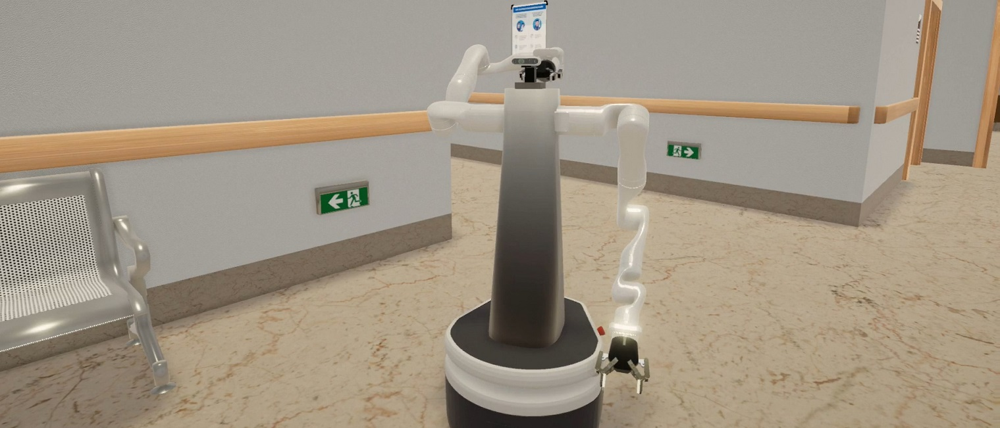
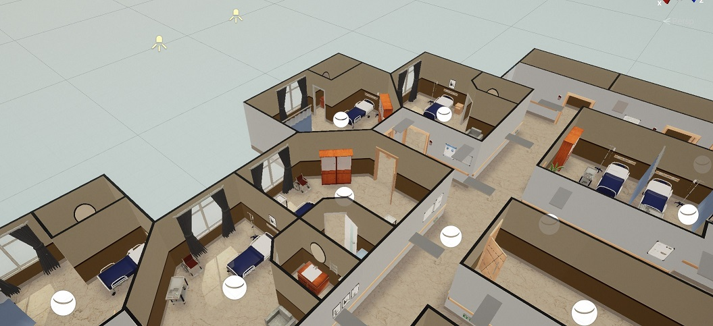

# Gopher In Unity Simulation
This package simulates Gopher nursing robot in [Unity](https://unity.com/), which could provide better graphic performance and interface design. Thanks to [Unity Robotics Hub](https://github.com/Unity-Technologies/Unity-Robotics-Hub), ROS-Unity connection is also provided in this repository for utilizing packages based on ROS.



## Dependencies
This repository has been developed and tested in Ubuntu 18.04 and ROS Melodic, with the latest Unity version 2021.1. There are some known issues with collision detection and lighting in the previous 2020 LTS Unity versions.

Before running this package, it is highly recommended to go through the tutorial of [Unity Robotics Hub](https://github.com/Unity-Technologies/Unity-Robotics-Hub) demo first. They provided a very detailed instruction to set up a robot arm in Unity. Also, you should try this [tutorial on how to set up a mobile robot](https://github.com/ZhuoyunZhong/Mobile-Robot-Demo-with-Unity-ROS). The second tutorial provides more robot sensors and ROS publishers and subscribers examples. After these two tutorials, you should be able to understand how to set up a robot in Unity and how to communicate between ROS and Unity.

## Setup and Run

Download and install the proper Unity version via Unity Hub. In the folder for your unity project, git clone this repository for Unity simulation. Also, git clone the related [ROS repository](https://github.com/hiro-wpi/Gopher-ROS-Unity) in your catkin workspace and run catkin_make.

```
cd <Unity_Path>/Unity/Projects
git clone git@github.com:hiro-wpi/Gopher-In-Unity-Simulation.git
cd ~/catkin_ws/src
git clone git@github.com:hiro-wpi/Gopher-ROS-Unity.git
```

##### On the Unity side:

Open Unity Hub and in the Projects tab, select ADD to add the "Gopher-In-Unity-Simulation" folder. Select Unity version to be 2021.1 and open the project. The first time usually takes a longer time.

After launching the project, please navigate to the **Scenes** folder and open the Hospital scene.



You can toggle the visibility of the ceiling in the game object hierarchy. 

To set up your own environment or modify the current one, you can find all the models we use in the **Prefabs** folder. If you would like to import your own models, you could put them in the **Models** folder and create your own prefab. The only human model used in this simulation is a nurse model, which has simple walking function to move to a desired location. You can find the nurse prefab in **Character/Nurse** folder.

To import a robot in the simulation, please navigate to **Prefabs/Robot** folder. There are three robot prefabs ready to use, a mobile base, a 7-DOF robot arm and the Gopher. You can simply drag them into the scene and hit play. You should be able to control them using just keyboard and mouse.

##### On the ROS side:

It's worth mention that if you don't need to use any ROS packages, you don't have to connect the simulation with ROS. You could simply complete a UI and manually control the robots in Unity. 

If you need to use ROS packages, some examples of publishers and subscribers are provided in the **Script/ROSCommunication** folder. To use these scripts to talk to ROS, you need to launch the endpoint server on the ROS side by simply

```
roslaunch Gopher-ROS-Unity server.launch
```

## More

- This Unity simulation uses [URP](https://docs.unity3d.com/Packages/com.unity.render-pipelines.universal@13.0/manual/index.html) in stead of the default render pipeline for better graphical performance.

- Currently, we do not have velocity inverse kinematic solution for the 7-DOF robot arm. You could only manually control the velocity of each joint. If you really require velocity IK, I would recommend you to import a robot arm with no more than 6-DOF, and write the velocity IK solver yourself.

  For inverse kinematic solution, you could use the Move-It ROS package. But each computation usually can take up to a few seconds, which means it's not meant to be used for real-time.

- RGB-D camera sensor is still under development

- Robot State Publisher (Publish tf frames) will be released soon

